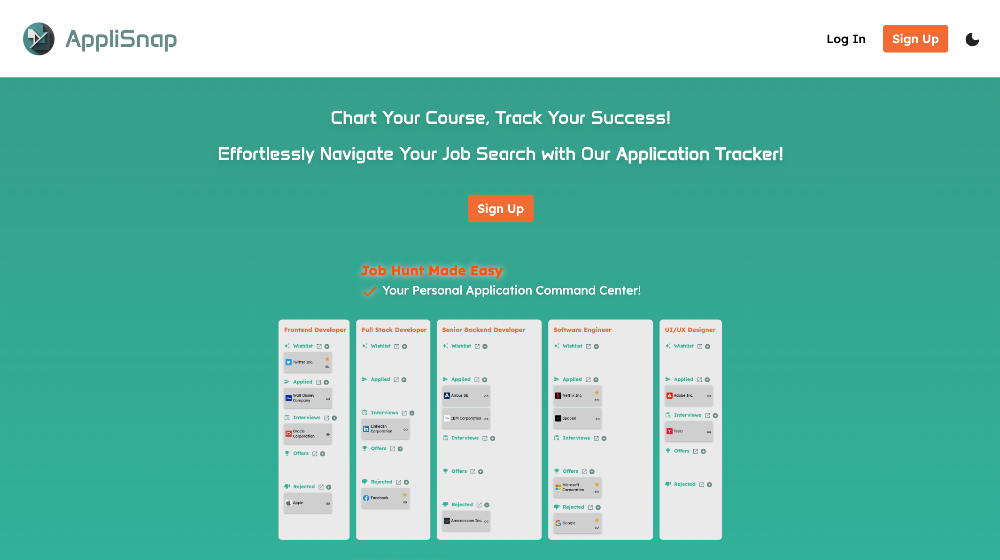

# AppliSnap

​
 

## Description

Simplify your job hunt with our clutter-free app. Track, organize, and manage all your applications effortlessly.

- Clean interface
- Centralized dashboard
- Custom Boards
  ​
   
  ​

## API's

​
[Clearbit](https://clearbit.com/logo)
​
 

## Packages

[axios](https://www.axios-http.com)

​[Material UI](https://mui.com/material-ui/)

[MUI X](https://mui.com/x/)

[Tailwind CSS](https://tailwindcss.com/)

[Vite Plugin PWA](https://github.com/vite-pwa/vite-plugin-pwa#readme)

[Dayjs](https://day.js.org/)
 ​

## Links

### Git

[Front-end](https://github.com/ruben-abreu/applisnap)

[Back-end](https://github.com/ruben-abreu/applisnap-backend)

[Chrome Extension](https://github.com/ruben-abreu/applisnap-chrome-extension)

[Deploy Link]()
​

### Contributors

​
Ana Patrícia Gomes - [`<anapatriciagomes>`](https://github.com/anapatriciagomes) - [`<Linkedin>`](https://www.linkedin.com/in/anapatriciagomes/)

Ruben Abreu - [`<ruben-abreu>`](https://github.com/ruben-abreu) - [`<Linkedin>`](https://www.linkedin.com/in/ruben-abreu1/)
